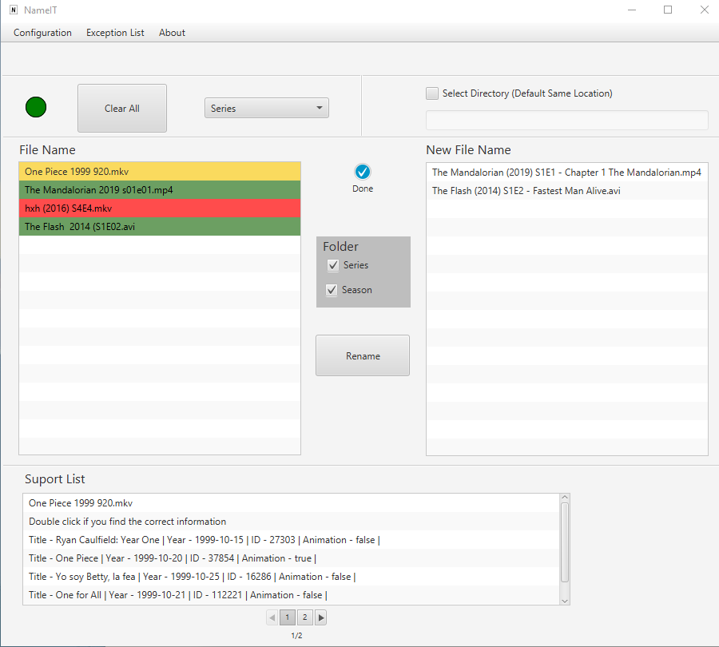

# NameIT - Simple Renamer

## About this Project

Name-IT is a Java / JavaFX program that aims to rename TV series and movie files easily and conveniently.

## Why?

The idea of developing the program was for personal necessity, after trying to use other free alternatives, none suited my needs.

As a programming student, this is the biggest project I have ever developed alone, learning several concepts for its use in the program. 
If you could provide me any feedback about the project, code or anything that you can report that could make me a better developer!

Email-me: bielmarfran@gmail.com

Connect with me at [LinkedIn](https://www.linkedin.com/in/gabriel-martins-franzin-55206b12a/).

## Download

See the [releases](https://github.com/bielmarfran/NameIT-Simple-Renamer/releases) page for the latest build.

## Functionalities

- Native GUI build using JavaFx
- SQLite database used for long-term caching, for better performance.
- Using information from [TMDb](https://www.themoviedb.org/).
- Custom nameing scheme.
- Exception rules, to assist in abbreviation or special cases.
- Support list that shows the options most likely to be correct.

## Getting Started

### Prerequisites

The project structure was developed based on [here](https://github.com/dlemmermann/JPackageScriptFX)
so show your support and follow their guide to set up the environment.

With the environment set up.

	git clone https://github.com/bielmarfran/NameIT-Simple-Renamer.git

Then  on the root of the project.

	mvn clean install

With that the msi installer will be generated in "*\nameit-main\target\installer". 
Or you can run the nameit-main project from your IDE.

## Built With

- [Java](https://www.oracle.com/java/technologies/)   		 
- [JavaFX](https://openjfx.io/) 					  		 
- [GSON](https://github.com/google/gson)	 		  		 
- [SQLite](https://www.sqlite.org/index.html) 		  		 
- [SQLite JDBC Driver](https://github.com/xerial/sqlite-jdbc)
- [Project structure](https://github.com/dlemmermann/JPackageScriptFX)

## License

This project is licensed under the Apache 2.0 - see the [LICENSE.md](https://github.com/bielmarfran/NameIT-Simple-Renamer/blob/master/LICENSE) file for details